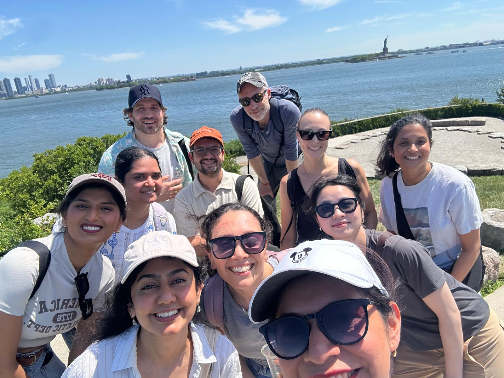
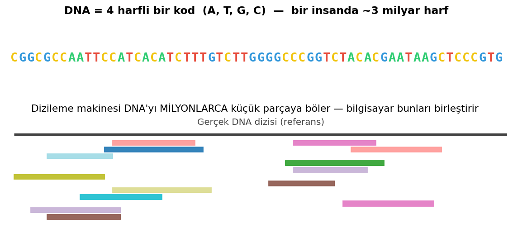
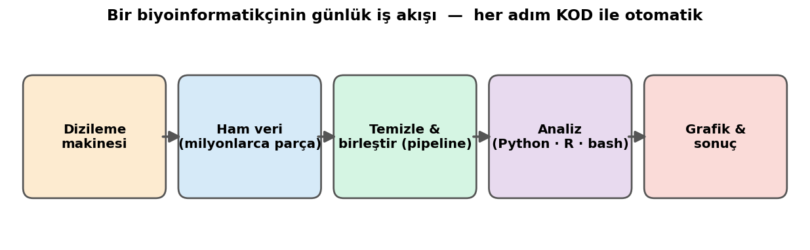
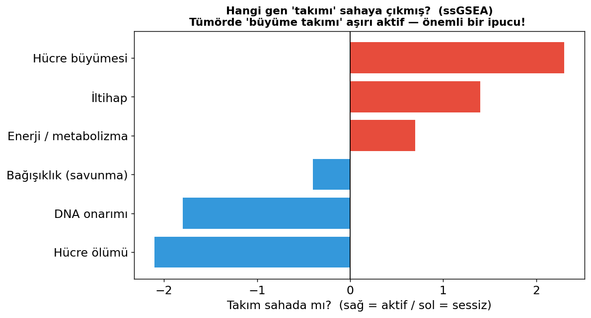
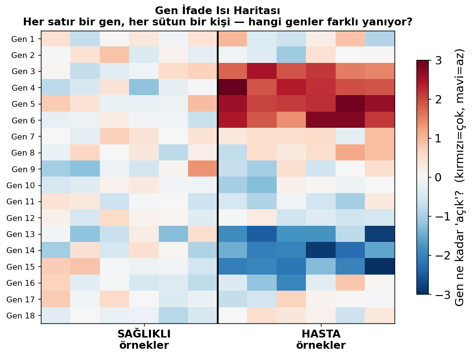
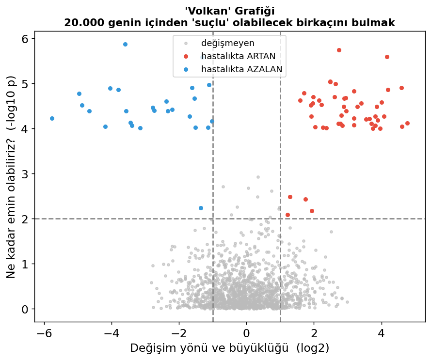

# 👩‍🔬 Eğitmeninizle Tanışın — Gülay Bengü Ulukaya

  
  

<b>Solda:</b> Ben (İstanbul, Boğaziçi 🌉) &nbsp;·&nbsp; <b>Sağda:</b> New York'ta birlikte çalıştığım BiNGS ekibi (arkada Özgürlük Heykeli 🗽)

Merhaba! 👋 Ben **Bengü**. Bu kamp boyunca sizinle birlikte koda, veriye ve biraz da
yapay zekâya yolculuk yapacağız. Başlamadan önce, kim olduğumu ve **gerçek hayatta her gün
ne iş yaptığımı** anlatmak istiyorum — çünkü bu hafta öğreneceğiniz şeylerin "ödev" değil,
gerçek bir mesleğin tam da kendisi olduğunu görmenizi istiyorum. 🌱

---

## 🧬 Mesleğim ne?

Ben bir **biyoinformatik analistiyim**. Kulağa havalı geliyor, değil mi? Aslında çok basit
bir fikir: **biyoloji + bilgisayar bilimi** bir araya geliyor.

Vücudumuzdaki her hücrenin içinde, onu nasıl çalışacağını anlatan dev bir "tarif kitabı"
var: **DNA**. Bu kitap yaklaşık **3 milyar harften** oluşuyor (A, T, G, C). Bir insanın DNA'sını
kâğıda yazsanız, üst üste koyduğunuzda bir gökdelen kadar yüksek olurdu! 🏙️ Hiçbir insan bunu
gözüyle okuyup "şurada bir hata var" diyemez. İşte burada **bilgisayar ve kod** devreye giriyor.

Biyoinformatik, kısaca: **biyolojinin ürettiği devasa veriyi bilgisayarla okuyup anlamlandırma
işidir.**

> 🧩 Dizileme makinesi DNA'yı milyonlarca **minik parçaya** böler. Bu parçaları doğru sırayla
> birleştirip okunabilir hâle getirmek — işte bilgisayarın ve kodun ilk görevi bu.

---

## 🔬 İşimde ne yapıyorum?

Ben **Mount Sinai Tıp Fakültesi'ndeki (Icahn School of Medicine at Mount Sinai) BiNGS
biyoinformatik biriminde** çalışıyorum. Burası, hastanedeki **birçok farklı araştırma
laboratuvarına** veri analizinde yardım eden bir merkez. Yani benim işim, tek bir konu değil —
aynı anda çok sayıda araştırmacıya el veriyorum. 🤝

Günlük işimi üç adımda anlatayım:

**1️⃣ Veriyi makineden almak.** Laboratuvarda **DNA dizileme makinesi** denen bir cihaz var.
Bu cihaz, bir hücrenin DNA'sını ya da RNA'sını okuyup **milyonlarca minik parçaya** ayrılmış
dev veri dosyaları üretiyor. 📸 (Bunu, bir cismi milyonlarca küçük fotoğrafa bölen bir kameraya
benzetebilirsiniz.) Makine her gün yeni veri üretiyor; ben de yazdığım kodlarla bu ham veriyi
makineden alıp, parçaları **doğru sırayla birleştirip** düzenliyorum.

**2️⃣ Veriyi temizleyip hazırlamak.** Ham veri dağınık ve hatalıdır — tıpkı bir yapbozun
karışık kutusu gibi. Yazdığım programlar (buna **"pipeline"**, yani işlem hattı diyoruz) bu
yapbozu otomatik olarak birleştirip her araştırmacının kullanabileceği temiz bir tabloya
çeviriyor. Aynı pipeline'ı **defalarca, farklı projeler için** yeniden kullanabiliyorum.

**3️⃣ Anlam çıkarmak.** Sonra asıl eğlenceli kısım: bu veriden **bir hikâye** çıkarmak.
Sevdiğim bir örnek:

> Hücredeki genler tek başına değil, **takımlar hâlinde** çalışır — tıpkı bir futbol takımı
> gibi. ⚽ "Hücre büyümesi takımı", "savunma (bağışıklık) takımı" gibi gen grupları vardır.
> Ben de bir analiz yöntemiyle (adı **ssGSEA**) soruyorum: *Bu hücrede hangi takım sahaya
> çıkmış, hangisi yedekte oturuyor?*
>
> Örneğin bir tümörde **"büyüme takımı" aşırı aktifse**, bu bize hastalığın neden
> kontrolden çıktığına dair önemli bir ipucu verir.

Bu yolda kullandığım iki klasik görsel daha var. **Isı haritası** ile binlerce genin hasta ve
sağlıklı kişilerde nasıl "yandığını" bir bakışta görürüm; **volkan grafiği** ile de 20.000 genin
içinden gerçekten farklı olan birkaçını yakalarım:

  
  

Bütün bunları **kod yazarak** yapıyorum: veriyi temizliyorum, analiz ediyorum ve sonunda
herkesin anlayabileceği **grafikler** hâline getiriyorum — tıpkı bu kampta yapacağınız gibi!
(Kullandığım diller: **Python, R ve bash** — bu hafta Python ile tanışacaksınız. 😊)

---

## ❤️ Bu neden önemli?

Çünkü o "farklı davranan birkaç gen", çoğu zaman bir hastalığın **anahtarıdır**:

- 🎗️ **Kanseri** anlamak: tümörü büyüten genleri bulmak, doğru ilacı seçmek.
- 💊 **Yeni tedaviler** geliştirmek: bir ilacın hücrede gerçekten işe yarayıp yaramadığını görmek.
- 🧑‍⚕️ **Kişiye özel tıp**: aynı hastalığın her insanda farklı olabileceğini görüp, herkese
  en uygun tedaviyi bulmak.

Yani benim bilgisayar başında yazdığım kod, bir gün bir hastanın daha iyi tedavi görmesine
yardımcı olabiliyor. İşte bu yüzden bu işi seviyorum. 💛

---

## 💻 Peki kod bilmek tam olarak neyi mümkün kılıyor?

Çok güzel bir soru — ve cevabı bu kampın özeti:

Benim analiz ettiğim veriler **Excel'e sığmayacak kadar büyük**. Milyonlarca sayı, on binlerce
gen, yüzlerce hasta... Bunları elle tek tek incelemek **imkânsız**. Ama kod yazmayı bilirseniz:

| Bu hafta öğreneceğiniz şey | Benim işimde karşılığı |
|---|---|
| **Değişkenler** (bilgiyi saklamak) | Bir hastanın, bir genin bilgisini tutmak |
| **Listeler & döngüler** (`for`) | 20.000 geni tek tek değil, **tek seferde** işlemek |
| **Fonksiyonlar** (`def`) | Aynı analizi 100 hasta için **tekrar tekrar** yazmadan çalıştırmak |
| **Veri okumak** (`CSV`) | Laboratuvardan gelen dev tabloları açmak |
| **Grafik çizmek** | Sonuçları doktorların anlayacağı resimlere dönüştürmek |

Gördünüz mü? **Bu hafta öğreneceğiniz her şey, benim her gün kullandığım gerçek araçlar.**
Kod bilmek, "imkânsız" görünen bir işi **birkaç saniyede** yapılabilir hâle getiriyor.

---

## 🌟 Son bir söz

Biyoinformatikçi olmak için dâhi olmaya gerek yok. Bende olan iki şey, sizde de var:
**merak** ve **denemekten korkmamak.** Hata yapmak, kod öğrenmenin en normal parçası — ben hâlâ
her gün hata yapıyorum ve düzeltiyorum. 🙂

Bu hafta birlikte küçük adımlarla başlayacağız ve haftanın sonunda kendi verinizi analiz edip
grafiğinizi çizmiş olacaksınız. Belki içinizden biri, bir gün benim meslektaşım olur. 💫

Hadi başlayalım! 🚀

*— Bengü*
